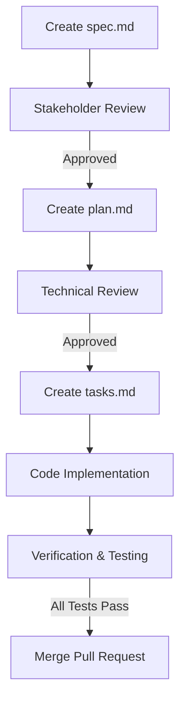

# Spec-Kit Constitution

This document governs the creation, review, and execution of specifications, plans, and task lists within the **Memento AI** repository.

---

## 1. Overview
The Spec-Kit framework is a structured documentation workflow designed to ensure software changes are:
1. **Clearly Defined (Spec)**: What are we building, why, and what are the requirements?
2. **Technically Planned (Plan)**: How will we build it, what is the architecture, and what files are modified?
3. **Meticulously Tracked (Tasks)**: What is the step-by-step TODO checklist?

---

## 2. Document Types

### A. System Specifications (`spec.md`)
- **Purpose**: Defines feature goals, functional/non-functional requirements, scope boundaries, and user journeys.
- **Location**: `specs/[feature-name]/spec.md`
- **Ownership**: Product Managers / Feature Leads.
- **Rule**: Must be completed and approved before any coding starts.

### B. Implementation Plans (`plan.md`)
- **Purpose**: Defines database migrations, API changes, module design, dependency changes, and security reviews.
- **Location**: `specs/[feature-name]/plan.md`
- **Ownership**: Technical Leads / Software Engineers.
- **Rule**: Must include a complete verification plan (automated and manual tests).

### C. Tasks Checklist (`tasks.md`)
- **Purpose**: A living checklist showing the status of each micro-task.
- **Location**: `specs/[feature-name]/tasks.md`
- **Ownership**: Developer executing the task.
- **Format**: Standard markdown checkboxes:
  - `[ ]` for uncompleted tasks
  - `[/]` for in-progress tasks
  - `[x]` for completed tasks

---

## 3. Workflow Lifecycle

1. **Phase 1: Alignment**: Create `spec.md` from the template. Align with stakeholders on scope.
2. **Phase 2: Architecture**: Create `plan.md` detailing the file changes, API signatures, and schemas.
3. **Phase 3: Execution**: Generate `tasks.md` to break work into small tasks. Code must not break existing offline/CPU-first properties of Memento AI.
4. **Phase 4: Walkthrough**: Document the final implementation, screenshots, and test coverage logs.
