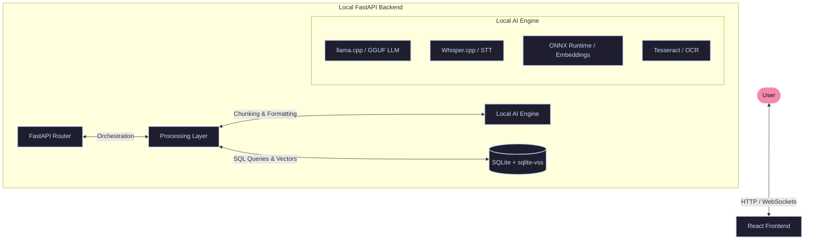
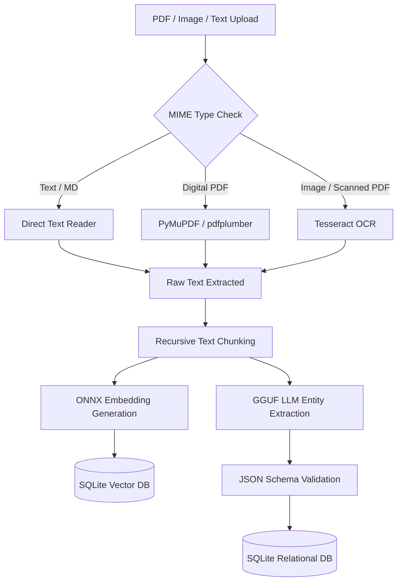
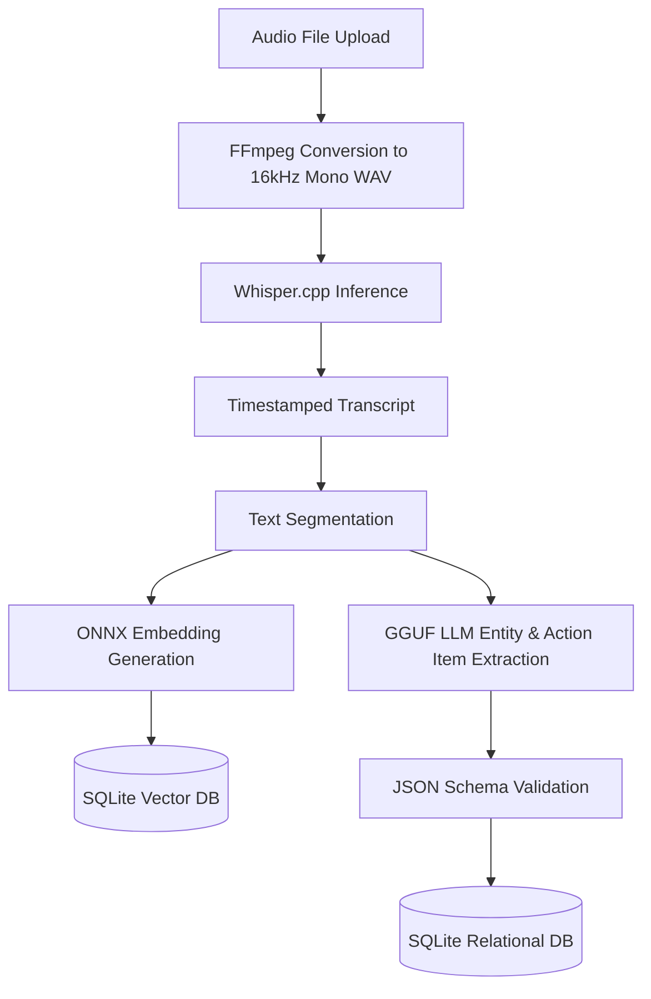

# Memento AI — Technical Architecture

This document describes the high-level system architecture, component design, data ingestion pipelines, and structural design choices for the **Memento AI** offline personal memory engine.

---

## 1. System Architecture Overview

Memento AI is designed as a local desktop service bundle consisting of a web-based React frontend and a FastAPI backend service.

### High-Level Architecture Diagram

---

## 2. Component Details

### A. React Frontend
- **Role**: Provides a clean, modern user interface for managing memories, viewing the timeline, uploading documents, and interacting with the local chat assistant.
- **Key Views**:
  - *Dashboard*: High-level summary of stored memories, recent activity, and system resource status.
  - *Knowledge Ingestion*: Drag-and-drop interface for documents, images, and audio files.
  - *Memory Timeline*: A chronological view of extracted memories, meetings, and events.
  - *Offline Chat*: Conversational interface for querying the personal memory graph.
- **Technology Stack**: React, Vite, TailwindCSS.

### B. FastAPI Backend
- **Role**: Serves as the orchestration layer. It exposes REST endpoints for file uploads, system settings, and chat queries, and maintains WebSockets for real-time processing logs.
- **Technology Stack**: Python 3.11+, FastAPI, Uvicorn, Pydantic.

### C. Processing Layer
- **Role**: Handles file parsing, metadata extraction, text normalization, and chunking. It coordinates the extraction pipeline based on the MIME type of the uploaded file.
- **Task Queue**: A lightweight, in-memory queue (using Python's `asyncio` or a simple SQLite-backed queue) ensures that CPU-intensive operations do not block the web server.

### D. Local AI Engine
- **Role**: Wraps the CPU-optimized AI runtimes:
  - **`llama.cpp`**: Executes quantized GGUF models. It loads the model into RAM once and processes prompt context using SIMD instruction sets.
  - **`Whisper.cpp`**: Executes speech-to-text inference.
  - **`ONNX Runtime`**: Runs the embedding model using the CPU execution provider, ensuring sub-100ms vectorization of text chunks.
  - **`Tesseract OCR`**: Extracts text from images and scanned documents.

### E. SQLite Database
- **Role**: Serves as the unified storage engine.
- **Relational Data**: Stores structured memories (people, projects, events, skills) in relational tables.
- **Vector Search**: Leverages the `sqlite-vss` extension (or a lightweight Python vector index) to store and perform similarity searches on text embeddings.

---

## 3. Data Pipelines

### A. Document & Image Ingestion Pipeline
This pipeline processes PDFs, markdown files, text documents, and images.

### B. Audio Ingestion Pipeline
This pipeline processes audio files (voice memos, meeting recordings, podcasts).

---

## 4. Key Architectural Decisions

### 1. CPU-First Architecture
To ensure the application can run on any consumer-grade computer, we prioritize **quantization** and **low memory footprints**:
- **4-bit Quantization (Q4_K_M)**: Reduces LLM size from ~15GB to ~2.2GB, allowing a 3B parameter model to run comfortably on systems with 8GB RAM while maintaining 90%+ of its reasoning capability.
- **Hardware Acceleration**: The runtimes are compiled with AVX2, AVX512, or ARM NEON instructions enabled. This allows the CPU to perform vector math in parallel without needing a GPU.

### 2. Offline-First Isolation
- **Air-Gapped Design**: The backend contains no networking libraries that point to external servers. It has zero external dependencies during runtime, removing any chance of data leaking.
- **Local Model Caching**: All required models (LLM, Whisper, ONNX Embeddings) are downloaded during setup/build phase or manually placed in the local app directory, never fetched dynamically during runtime.

### 3. Local Storage Strategy
- **SQLite Single-File Database**: All relational data, vector indices, and configuration states are saved in a single `memento.db` file. This makes backing up, migrating, or deleting user data extremely simple (the user can delete their entire memory history by deleting a single folder).
