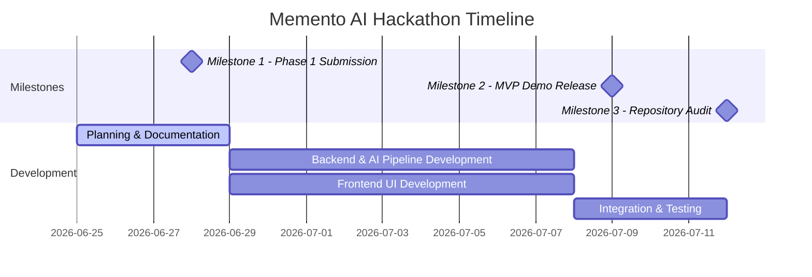

# Memento AI — Team Work Plan & Milestone Schedule

This document details the division of labor, task estimations, and project milestones for the **Memento AI** development team.

---

## Team Roles & Responsibilities

The team consists of exactly **two members**. Responsibilities are divided cleanly between backend/AI engine development and frontend/DevOps orchestration to ensure parallel progress.

### 🧑‍💻 Member 1
- **Role**: AI + Backend Engineer
- **Core Responsibilities**:
  - Setting up `llama.cpp` and integrating GGUF models.
  - Designing the local AI pipeline (orchestrating OCR, Speech-to-Text, and Embeddings).
  - Writing document parsers (PDF, TXT, MD) and OCR integration.
  - Setting up `Whisper.cpp` for local audio transcription.
  - Building the FastAPI backend server and API endpoints.
  - Designing the SQLite database schema and vector similarity retrieval logic.
- **Estimated Total Effort**: 25 Hours

### 🧑‍🎨 Member 2
- **Role**: Frontend + DevOps Engineer
- **Core Responsibilities**:
  - Designing and building the React user interface.
  - Implementing the offline chat interface and source citation viewer.
  - Creating the file upload and processing pipeline dashboard.
  - Creating the structured memory dashboard and timeline view.
  - Managing GitLab repository setup, branching, and pull request reviews.
  - Authoring project documentation (specifications, architecture, demo guides).
  - Setting up local testing suites and CI/CD validation scripts.
- **Estimated Total Effort**: 25 Hours

---

## Detailed Task Table

| Task | Category | Owner | Est. Hours | Deadline | Status |
| :--- | :--- | :--- | :--- | :--- | :--- |
| **Phase 1: Planning & Specification** | Documentation | Member 2 | 4 hrs | Day 2 | **Completed** |
| **GitLab Setup & Repo Architecture** | DevOps | Member 2 | 2 hrs | Day 2 | **Completed** |
| **Local SQLite & Vector Schema Design** | Backend | Member 1 | 3 hrs | Day 4 | Pending |
| **FastAPI Core Setup & File Endpoints** | Backend | Member 1 | 3 hrs | Day 5 | Pending |
| **llama.cpp & GGUF Model Integration** | AI Engine | Member 1 | 5 hrs | Day 6 | Pending |
| **Whisper.cpp & Audio Transcription Pipeline** | AI Engine | Member 1 | 5 hrs | Day 8 | Pending |
| **OCR & PDF Extraction Integration** | AI Engine | Member 1 | 4 hrs | Day 9 | Pending |
| **React UI Core & Theme Styling** | Frontend | Member 2 | 5 hrs | Day 7 | Pending |
| **Upload & Processing Dashboard** | Frontend | Member 2 | 4 hrs | Day 9 | Pending |
| **Chat & Retrieval UI Integration** | Frontend | Member 2 | 5 hrs | Day 11 | Pending |
| **RAG Retrieval & Context Assembly** | Backend | Member 1 | 5 hrs | Day 11 | Pending |
| **Offline Integration & Edge Case Testing**| QA / DevOps | Member 1 & 2| 6 hrs | Day 13 | Pending |
| **MVP Demo Video & Final Documentation** | Docs / DevOps | Member 2 | 4 hrs | Day 14 | Pending |

---

## Project Milestones

### 📍 Milestone 1: Phase 1 Submission (Current)
* **Goal**: Deliver a complete repository structure, technical specification, system architecture design, demo script, and work plan.
* **Deliverables**:
  - `docs/SPEC.md`
  - `docs/ARCHITECTURE.md`
  - `docs/DEMO.md`
  - `docs/WORK_PLAN.md`
  - `CONTRIBUTING.md`
  - `CHANGELOG.md`
  - `LICENSE`

### 📍 Milestone 2: MVP Demo
* **Goal**: A fully functioning offline desktop application capable of processing text, PDF, and audio files, and answering queries with local AI.
* **Deliverables**:
  - Fully integrated React frontend and FastAPI backend.
  - Working local `llama.cpp` and `Whisper.cpp` engines.
  - Semantic search retrieval using local SQLite database.
  - Screen recording demonstrating the application working in 100% offline mode.

### 📍 Milestone 3: Repository Audit & Final Hand-off
* **Goal**: Code optimization, clean-up, and final repository packaging.
* **Deliverables**:
  - Cleaned codebase with zero debug artifacts.
  - Optimized model loading times and thread utilization.
  - Detailed installation guide and developer onboarding instructions in `README.md`.
